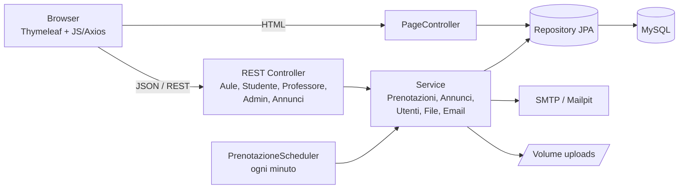
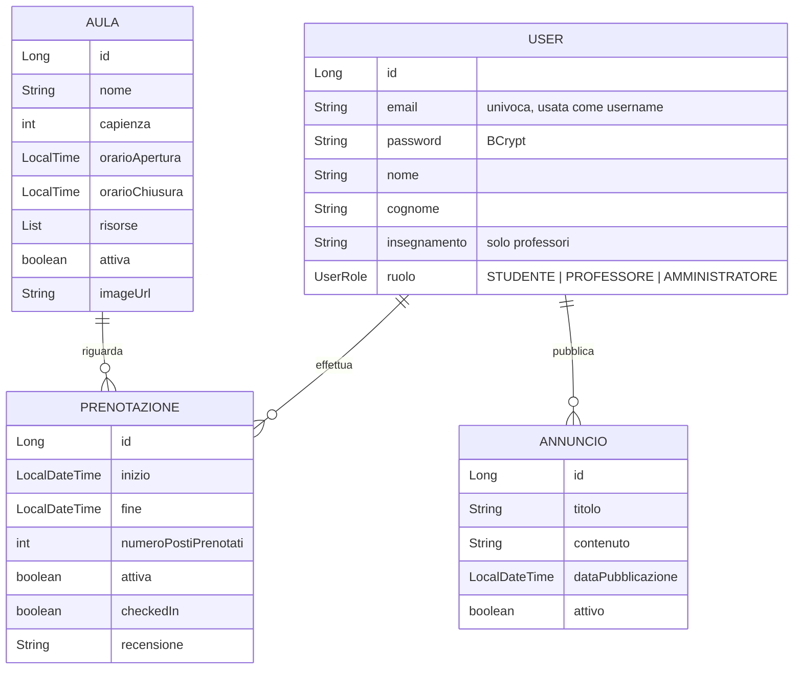

# Gestione Aule Studio

Web application per la **prenotazione di aule studio universitarie**, sviluppata per il corso di
*Ingegneria dei Sistemi Web* (Università di Ferrara).

Studenti e professori prenotano posti o intere aule, gli amministratori gestiscono aule, utenti,
prenotazioni e annunci. Le principali azioni generano notifiche email.


---

## Indice

- [Funzionalità](#funzionalità)
- [Stack tecnologico](#stack-tecnologico)
- [Avvio rapido con Docker](#avvio-rapido-con-docker)
- [Account dimostrativi](#account-dimostrativi)
- [Configurazione](#configurazione)
- [Sviluppo locale senza Docker](#sviluppo-locale-senza-docker)
- [Architettura](#architettura)
- [Regole di business](#regole-di-business)
- [API REST](#api-rest)
- [Sicurezza](#sicurezza)
- [Risoluzione problemi](#risoluzione-problemi)

---

## Funzionalità

### Visitatore (non autenticato)
- Homepage con carosello delle aule e numero di posti occupati in tempo reale
- Bacheca degli annunci attivi
- Registrazione e login

### Studente
- Visualizzazione della disponibilità di un'aula a slot di 30 minuti
- Prenotazione di un **singolo posto** (max 4 ore, entro l'orario di apertura dell'aula)
- **Check-in** entro 15 minuti dall'inizio, altrimenti la prenotazione viene annullata automaticamente
- Elenco paginato delle proprie prenotazioni (filtro attive / terminate), annullamento
- Recensione delle prenotazioni terminate

### Professore
- Prenotazione di un'**intera aula** con preavviso tra 2 e 14 giorni (max 4 ore)
- Elenco paginato e annullamento delle proprie prenotazioni

### Amministratore
- Creazione, modifica (incluso upload immagine), attivazione/disattivazione ed eliminazione delle aule.
  Disattivando un'aula, le sue prenotazioni attive vengono terminate e gli utenti avvisati via email
- Consultazione delle prenotazioni per aula e data, terminazione, **esportazione in PDF**
- Gestione utenti: ricerca, filtro per ruolo, modifica ed eliminazione (gli admin sono protetti)
- Gestione annunci: creazione (con email a tutti gli studenti e professori), modifica, archiviazione, eliminazione

---

## Stack tecnologico

| Livello   | Tecnologie |
|-----------|------------|
| Backend   | Java 21, Spring Boot 3.4 (Web, Data JPA, Security, Mail, Scheduling), Lombok |
| Frontend  | Thymeleaf, Bulma CSS, JavaScript, Axios, Font Awesome, pdfmake |
| Database  | MySQL 8 (Hibernate, schema generato automaticamente) |
| Email     | SMTP (Mailpit in sviluppo, qualsiasi provider in produzione) |
| Build     | Gradle (wrapper incluso) |
| Container | Docker, Docker Compose |

---

## Avvio rapido con Docker

**Requisiti:** [Docker](https://docs.docker.com/get-docker/) con il plugin Docker Compose.
Non servono né Java né MySQL sulla macchina.

```bash
git clone https://github.com/TosiMatteo/IngSistemiWeb_App.git
cd IngSistemiWeb_App
docker compose up -d --build
```

Il primo avvio richiede qualche minuto (download delle immagini e build con Gradle). Poi:

| Servizio | URL |
|----------|-----|
| Applicazione | <http://localhost:8080> |
| Mailpit (email inviate dall'app) | <http://localhost:8025> |

Lo stack avvia tre container:

| Container | Immagine | Ruolo |
|-----------|----------|-------|
| `gestione-aule-app` | build del `Dockerfile` | Applicazione Spring Boot |
| `gestione-aule-db` | `mysql:8.4` | Database (volume `db-data`) |
| `gestione-aule-mail` | `axllent/mailpit` | Server SMTP finto che raccoglie le email |

### Comandi utili

```bash
docker compose logs -f app        # log dell'applicazione
docker compose ps                 # stato dei container
docker compose down               # ferma lo stack (i dati restano nei volumi)
docker compose down -v            # ferma lo stack e CANCELLA database e immagini caricate
docker compose up -d --build app  # ricompila e riavvia solo l'app dopo una modifica al codice
```

---

## Account dimostrativi

Al primo avvio, se il database è vuoto, vengono creati questi utenti e tre aule di esempio:

| Ruolo | Email | Password |
|-------|-------|----------|
| Amministratore | `admin@demo.it` | `admin` |
| Professore | `professore@demo.it` | `professore` |
| Studente | `studente@demo.it` | `studente` |

Per non creare i dati dimostrativi imposta `SEED_DEMO_DATA=false`.
Su un'installazione pubblica **cambia le password** o elimina questi account.

---

## Configurazione

Tutta la configurazione avviene tramite variabili d'ambiente. Con Docker Compose basta creare un file
`.env` partendo dall'esempio (il file `.env` è ignorato da git):

```bash
cp .env.example .env
```

| Variabile | Default (Docker) | Descrizione |
|-----------|------------------|-------------|
| `APP_PORT` | `8080` | Porta dell'applicazione sull'host |
| `MAILPIT_UI_PORT` | `8025` | Porta dell'interfaccia web di Mailpit |
| `DB_NAME` | `Web_app` | Nome del database |
| `DB_USERNAME` / `DB_PASSWORD` | `aule` / `aule_password` | Credenziali MySQL dell'app |
| `DB_ROOT_PASSWORD` | `root_password` | Password root di MySQL |
| `SEED_DEMO_DATA` | `true` | Crea utenti e aule dimostrativi se il DB è vuoto |
| `MAIL_HOST` / `MAIL_PORT` | `mailpit` / `1025` | Server SMTP |
| `MAIL_USERNAME` / `MAIL_PASSWORD` | vuoti | Credenziali SMTP |
| `MAIL_SMTP_AUTH` / `MAIL_SMTP_STARTTLS` | `false` / `false` | Opzioni SMTP |
| `MAIL_FROM` | `noreply@gestione-aule.local` | Mittente delle email |

Variabili disponibili solo fuori da Docker Compose (o aggiungendole al servizio `app`):
`DB_URL`, `UPLOAD_DIR` (default `./uploads`), `SHOW_SQL`, `THYMELEAF_CACHE`.

> **Nota:** le credenziali del database vengono applicate da MySQL solo alla prima creazione del volume.
> Se le cambi dopo, esegui `docker compose down -v` (perdendo i dati) oppure aggiornale a mano in MySQL.

### Inviare email reali (es. Gmail)

1. Attiva la verifica in due passaggi sull'account Google e crea una
   [password per le app](https://myaccount.google.com/apppasswords).
2. Nel file `.env`:
   ```dotenv
   MAIL_HOST=smtp.gmail.com
   MAIL_PORT=587
   MAIL_USERNAME=tuo.indirizzo@gmail.com
   MAIL_PASSWORD=la-tua-app-password
   MAIL_SMTP_AUTH=true
   MAIL_SMTP_STARTTLS=true
   MAIL_FROM=tuo.indirizzo@gmail.com
   ```
3. `docker compose up -d`

Se il server SMTP non è raggiungibile l'applicazione continua a funzionare: l'errore viene solo scritto nel log.

---

## Sviluppo locale senza Docker

**Requisiti:** JDK 21 e un MySQL 8 raggiungibile.

```bash
# (opzionale) solo database e Mailpit in Docker, esponendo MySQL sulla porta 3306:
docker run -d --name aule-mysql -e MYSQL_ROOT_PASSWORD=root -p 3306:3306 mysql:8.4
docker run -d --name aule-mailpit -p 1025:1025 -p 8025:8025 axllent/mailpit

# avvio dell'applicazione (i default puntano a localhost:3306, utente root/root, SMTP localhost:1025)
./gradlew bootRun
```

Per usare credenziali diverse:

```bash
DB_USERNAME=root DB_PASSWORD=la_tua_password ./gradlew bootRun
```

Il database `Web_app` viene creato automaticamente se non esiste; le tabelle sono generate da Hibernate
(`ddl-auto=update`). Le immagini caricate finiscono in `./uploads`.

### Test

```bash
./gradlew test
```

I test usano un database H2 in memoria, quindi non richiedono MySQL.

---

## Architettura

Applicazione monolitica Spring Boot organizzata a livelli: le pagine sono generate lato server con
Thymeleaf, mentre le interazioni dinamiche avvengono via JavaScript (Axios) verso API REST JSON.



### Struttura del progetto

```
src/main/java/com/example/ingsistemiweb_app/
├── config/         # WebConfig (/uploads), Thymeleaf, dati dimostrativi
├── controller/     # PageController (viste) + controller REST
├── dto/            # oggetti di scambio per le API
├── model/          # entità JPA: User, Aula, Prenotazione, Annuncio
├── repository/     # interfacce Spring Data JPA
├── security/       # Spring Security: regole di accesso, login, UserDetailsService
└── service/        # logica di business, scheduler, email, storage file
src/main/resources/
├── templates/      # pagine Thymeleaf (index, login, registrazione, dashboard per ruolo, admin)
└── static/         # CSS (Bulma), JavaScript, immagini
Docs/               # relazione descrittiva di pagine, script, sicurezza e controller
```

### Modello dei dati



Una descrizione più discorsiva di pagine, script JavaScript, sicurezza e controller si trova nella
cartella [`Docs/`](Docs/).

---

## Regole di business

| Regola | Studente | Professore |
|--------|----------|------------|
| Posti prenotati | 1 | Intera capienza dell'aula |
| Durata massima | 4 ore | 4 ore |
| Vincolo temporale | Stessa giornata, dentro l'orario di apertura dell'aula | Preavviso tra 2 e 14 giorni |
| Disponibilità | La somma dei posti delle prenotazioni attive sovrapposte non può superare la capienza | idem (serve l'aula libera) |
| Sovrapposizioni | Nessuna altra prenotazione attiva dello stesso utente nello stesso intervallo | idem |
| Check-in | Obbligatorio entro 15 minuti dall'inizio, altrimenti annullamento automatico | Non richiesto |

Tutti gli orari sono gestiti nel fuso `Europe/Rome`.

Email inviate automaticamente: conferma e annullamento prenotazione, terminazione per aula disattivata,
modifica ed eliminazione dell'account, pubblicazione di un nuovo annuncio.

---

## API REST

Tutte le chiamate che modificano dati (POST/PUT/DELETE) richiedono una sessione autenticata e il token
CSRF (header `X-CSRF-TOKEN`, esposto nei meta tag `_csrf` delle pagine).

### Aule — `/api/aule`

| Metodo | Endpoint | Accesso | Descrizione |
|--------|----------|---------|-------------|
| GET | `/api/aule` | autenticato | Elenco di tutte le aule |
| GET | `/api/aule/aule/attive` | autenticato | Solo aule attive |
| GET | `/api/aule/{id}` | autenticato | Dettaglio aula |
| GET | `/api/aule/{id}/disponibilita?data=YYYY-MM-DD` | autenticato | Posti liberi a slot di 30 minuti |
| GET | `/api/aule/{id}/posti-occupati` | pubblico | Posti occupati in questo momento |
| POST | `/api/aule` (multipart) | admin | Crea aula (`nome`, `capienza`, `risorse`, `orarioApertura`, `orarioChiusura`, `attiva`, `immagineFile`) |
| PUT | `/api/aule/{id}` (multipart) | admin | Modifica aula |
| DELETE | `/api/aule/{id}` | admin | Elimina aula, le sue prenotazioni e l'immagine |

### Studente — `/api/studente`

| Metodo | Endpoint | Descrizione |
|--------|----------|-------------|
| POST | `/prenotazioni` | Nuova prenotazione `{ "aulaId": 1, "inizio": "2025-01-01T10:00:00+01:00", "fine": "..." }` |
| GET | `/prenotazioni?stato=tutte\|attive\|terminate&page=0&size=10` | Prenotazioni paginate |
| POST | `/prenotazioni/{id}/termina` | Annulla una prenotazione |
| POST | `/prenotazioni/{id}/check-in` | Check-in |
| POST | `/prenotazioni/{id}/recensione` | Recensione (testo nel body) |

### Professore — `/api/professore`

| Metodo | Endpoint | Descrizione |
|--------|----------|-------------|
| POST | `/prenotazioni` | Prenota l'intera aula (stesso body dello studente) |
| GET | `/prenotazioni?stato=...&page=...&size=...` | Prenotazioni paginate |
| POST | `/prenotazioni/{id}/termina` | Annulla una prenotazione |

### Amministratore — `/api/admin`

| Metodo | Endpoint | Descrizione |
|--------|----------|-------------|
| GET | `/prenotazioni?aulaId=1&data=YYYY-MM-DD` | Prenotazioni di un'aula in una data |
| POST | `/prenotazioni/{id}/termina` | Termina una prenotazione |
| GET | `/users?ruolo=...&searchTerm=...&page=...` | Ricerca utenti paginata |
| PUT | `/users/{id}` | Modifica utente `{ nome, cognome, email, password? }` |
| DELETE | `/users/{id}` | Elimina utente e relative prenotazioni |

### Annunci — `/api/annunci`

| Metodo | Endpoint | Accesso | Descrizione |
|--------|----------|---------|-------------|
| GET | `/attivi` | pubblico | Annunci attivi |
| GET | `/admin/all` | admin | Tutti gli annunci |
| GET | `/admin/{id}` | admin | Dettaglio annuncio |
| POST | `/` | admin | Crea annuncio `{ titolo (≤100), contenuto (≤1000) }` |
| PUT | `/{id}` | admin | Modifica `{ titolo, contenuto, attivo }` |
| POST | `/{id}/disattiva` | admin | Archivia annuncio |
| DELETE | `/{id}` | admin | Elimina annuncio |

### Pagine

| Percorso | Accesso |
|----------|---------|
| `/`, `/index`, `/login`, `/registrazione` | pubblico |
| `/studenteDashboard` | studente |
| `/professoreDashboard` | professore |
| `/amministratoreDashboard`, `/admin/users`, `/admin/annunci` | amministratore |

---

## Sicurezza

- Autenticazione con form login di **Spring Security**; l'email è lo username
- Autorizzazione basata sui ruoli (`STUDENTE`, `PROFESSORE`, `AMMINISTRATORE`), con redirect alla
  dashboard corretta dopo il login
- Password salvate con **BCrypt**. Le password in chiaro di database creati con versioni precedenti del
  progetto vengono ancora accettate, così i vecchi account continuano a funzionare
- Protezione **CSRF** attiva su form e chiamate AJAX
- Credenziali e configurazione solo tramite variabili d'ambiente, nessun segreto nel repository
- Il container dell'applicazione gira con un utente non privilegiato

> **Limiti noti (progetto didattico):** la registrazione permette di scegliere liberamente qualsiasi
> ruolo, amministratore compreso. Prima di esporre l'app su Internet conviene rimuovere l'opzione
> "Admin" dal form di registrazione e mettere un reverse proxy HTTPS davanti al container.

---

## Risoluzione problemi

| Problema | Soluzione |
|----------|-----------|
| `permission denied while trying to connect to the docker API` | Aggiungi l'utente al gruppo docker: `sudo usermod -aG docker $USER`, poi esci e rientra (o usa `sudo docker compose ...`) |
| `port is already allocated` | Cambia `APP_PORT` o `MAILPIT_UI_PORT` nel file `.env` |
| L'app si riavvia in loop all'avvio | Controlla `docker compose logs app`. Se hai cambiato le credenziali DB dopo il primo avvio vedi la nota in [Configurazione](#configurazione) |
| Le email non arrivano | Con la configurazione di default arrivano in Mailpit (<http://localhost:8025>). Con Gmail verifica di usare una *password per le app* |
| Voglio ripartire da zero | `docker compose down -v && docker compose up -d --build` |
